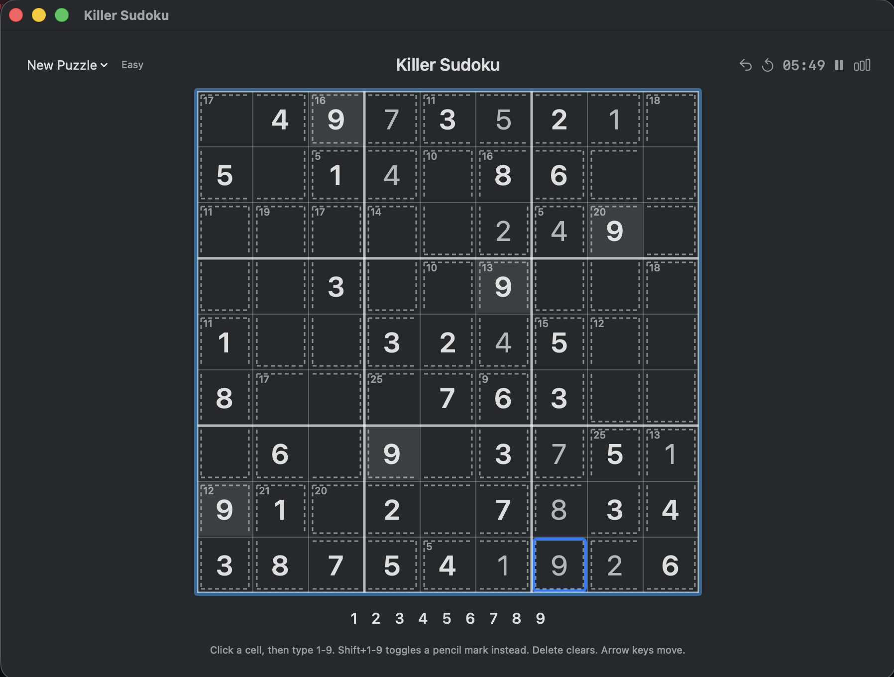

# Killer Sudoku

A native Killer Sudoku app — fully on-device puzzle generation, no ads, no accounts, no network
calls at all. Two builds share the same rules, the same puzzle-generation logic, and the same
UI/UX, built for different reach:

- **macOS app** (`Sources/`) — SwiftUI + Canvas, native to the Mac.
- **Desktop app for macOS, Windows, and Linux** (`desktop-kotlin/`) — Kotlin + Compose
  Multiplatform, its own renderer so the look matches the Swift build cell-for-cell.

Pick whichever build matches your OS in [Building and running](#building-and-running) below.



## Features

- On-device puzzle generator (no bundled puzzle set) — every puzzle is freshly generated and
  verified to have exactly one solution before it's shown to you
- Four difficulty tiers (Easy → Expert), driven by given-density: sparse hints at Expert, dense
  hints at Easy
- Pencil marks, undo/redo, a Reset button (clears your progress, keeps the same puzzle), and
  continuous auto-save — quit anytime, pick up exactly where you left off
- Best-time and solve-count tracking per difficulty tier
- Subtle animations for mistakes, completed cages, completed rows/columns/boxes, and finishing
  the whole puzzle

## How to play

Click a cell, then type a digit to fill it in. The basics are standard Sudoku plus one added
rule: every dashed-outline **cage** must sum to the small number shown in its corner, using no
repeated digit within that cage.

A few things that aren't obvious from the UI alone:

- **Pencil marks**: `Shift`+digit toggles a small note in that cell instead of filling it in.
  Notes render as a 3×3 mini-grid inside the cell — digit 1 in the top-left slot, 5 in the
  center, 9 in the bottom-right, and so on — rather than a plain list.
- **Delete** clears the cell's digit if it has one; otherwise it clears all pencil marks in that
  cell.
- **Given digits** (the puzzle's starting clues) render bold at full brightness; digits you've
  entered yourself render lighter — a visual cue that givens can't be edited or deleted.
- Placing a digit automatically removes that same digit from pencil marks in every cell sharing
  its row, column, or 3×3 box.
- Arrow keys move the selection; `Cmd+Z` / `Cmd+Shift+Z` undo/redo.
- Once a puzzle is solved, the board locks and a summary sheet appears — the only way out is
  picking a new puzzle.

## Building and running

### macOS (SwiftUI)

Requires macOS 14+ and a Swift 6 toolchain (Xcode 16+, or the Swift.org toolchain).

```sh
git clone https://github.com/G-Eskayo/killer-sudoku.git
cd killer-sudoku
./scripts/run-app.sh
```

This builds a release binary, wraps it in a real `.app` bundle (so it gets a proper Dock icon and
keyboard focus — see `docs/adr/0004`), and launches it. Pass `debug` as an argument
(`./scripts/run-app.sh debug`) for faster rebuilds while you don't care about runtime speed.

To run the test suite instead:

```sh
swift test
```

### macOS, Windows, or Linux (Kotlin + Compose Multiplatform)

Requires a JDK 17+. No separate Gradle install needed — the wrapper downloads it.

```sh
git clone https://github.com/G-Eskayo/killer-sudoku.git
cd killer-sudoku/desktop-kotlin
./gradlew run          # macOS/Linux
gradlew.bat run        # Windows
```

To build a native, double-clickable installer for your OS instead of running from source:

```sh
./gradlew packageDmg   # macOS
./gradlew packageMsi   # Windows
./gradlew packageDeb   # Linux
```

The installer lands under `desktop-kotlin/build/compose/binaries/main/<format>/`. Each format
packages only on its own OS (`jpackage` doesn't cross-compile) — build the `.dmg` on a Mac, the
`.msi` on Windows, the `.deb` on Linux.

To run the test suite instead:

```sh
./gradlew test
```

## Architecture

`CONTEXT.md` is the domain glossary; `docs/adr/` holds the real architectural decisions and the
reasoning behind them (why classic-mode givens work the way they do, why generation runs in
parallel batches, and so on). Start there before making a structural change — both builds follow
the same decisions, ported rather than reinvented.
